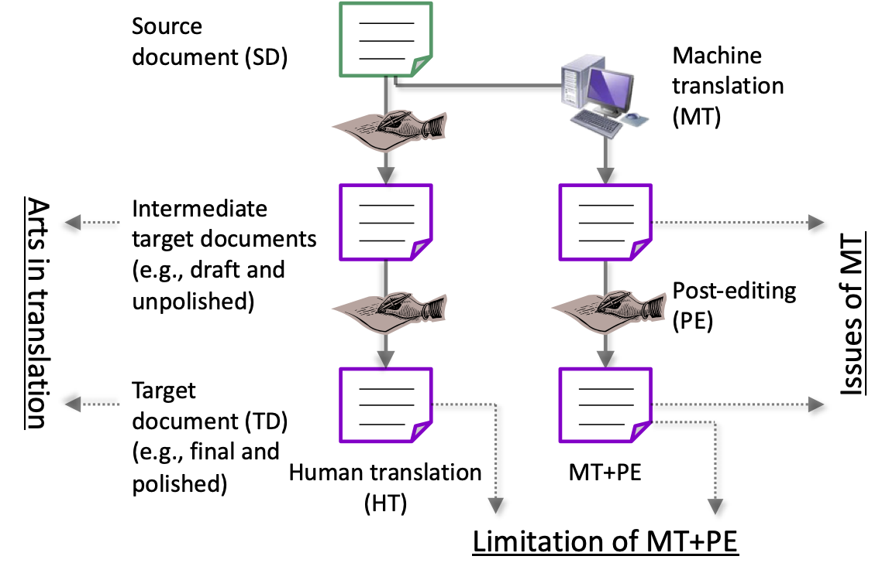

# MultiEnJa

## Introduction

This repository contains 46 examples of English source documents (SDs) in various content domains that are often dealt with by translation service providers (TSPs) and several types of translation-related derivatives that we have annotated and produced aiming to analyze the norms and competences in the translation process.

## Contents

Textual data of source documents are found [here](source-document).

For all of them, we have so far produced the following types of derivatives (See README.md in each directory for the details).
* [Professional translation](human-translation)
* [Post-edited machine translation outputs](MT-PE)
* [Unpolished/Polished translation pairs](unpolished-polished)

Figure 1 summarizes the processes of producing these heterogeneous translations and what can be analyzed by comparing some of them.
* MT outputs vs. their post-edited version: the issues of MT
* Human translation (HT) vs. MT+PE: the gap between what can be assured by ISO/TC37 (2015) and ISO/TC37 (2017)
* Draft/unpolished translation vs. final/polished translation: the art in human translation (or translation strategies)

 Fig. 1: Overview of the processes of producing translations and their purposes.

## Todo

* Include other types of derivatives.
* Extend the number of documents as well as translation directions.

## References

* ISO/TC37. ISO 17100:2015 [Translation Services: Requirements for Translation Services](https://iso.org/standard/59149.html). 2015.
* ISO/TC37. ISO 18587:2017 [Translation Services: Post-editing of Machine Translation Output: Requirements](https://iso.org/standard/62970.html). 2017.

## License

* We collected [the source documents](source-document) manually.  See [this JSON file](source-document/license.json) for their origin and license.
* Use and/or redistribution of this dataset, except for [the source documents](source-document), is permitted under the conditions of [Creative Commons Attribution-NonCommercial-ShareAlike License 4.0](https://creativecommons.org/licenses/by-nc-sa/4.0/).
* Please carefully read README.md in subdirectories and precisely confirm the attribution (BY) of each outcome.

## Acknowledgments

This dataset is an outcome of JSPS KAKENHI Grant-in-Aid for Scientific Research (S) [19H05660, Developing a Translation Process Model and Constructing an Integrated Translation Environment through Detailed Descriptions of Translation Norms and Competences](https://kaken.nii.ac.jp/en/grant/KAKENHI-PROJECT-19H05660/).
